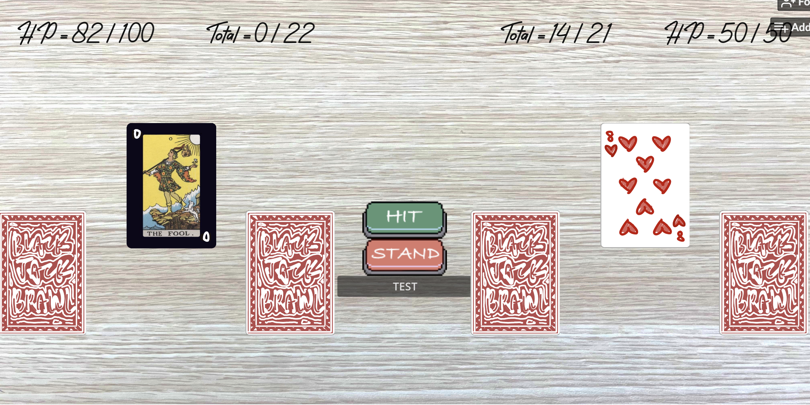

# BlackJack Brawl

## Summary

BlackJack Brawl is a fresh take on the classic card game of Blackjack, with exciting new twists. Inspired by the indie game [Dungeons & Degenerate Gamblers](https://store.steampowered.com/app/2400510), it adds unique mechanics to make the gameplay more fun and action-packed. Players face off against a computer opponent in rounds of Blackjack, where winning a round damages the loser’s health. The game ends when one player’s HP drops to zero.

Special cards and power-ups spice things up, letting players turn the tables and add new strategies to the game. These features make each match unique and exciting. BlackJack Brawl takes a classic game and turns it into an intense, fun-filled battle.

## Project Resources

[Web-playable version of your game.](https://quiet98k.itch.io/blackjack-brawl)  
[Trailor](https://youtube.com)  
[Press Kit](https://dopresskit.com/)  
[Proposal: make your own copy of the linked doc.](https://docs.google.com/document/d/1dR0EvuOv7iCBKyy8sixcwPdA1tQQCq9yUs0h4VcHsjM/edit?usp=sharing)

## Gameplay Explanation

**In this section, explain how the game should be played. Treat this as a manual within a game. Explaining the button mappings and the most optimal gameplay strategy is encouraged.**

In BlackJack Brawl, the player plays a modified version of blackjack with augmented rules against a computer enemy. In regular blackjack, the player(s) and the dealer take turns drawing a random card from your deck (aka "hitting") and adding its value to their total. The players stop when they feel they don't need to draw more cards (aka "standing"). Whoever gets closest to a total of 21 without going over is the winner. If you go over 21, you "bust" and automatically lose.

There are four "classes" of deck in BlackJack Brawl (2 defense and 2 offense): Club, Spades, Heart, and Diamond.

- **Club**: deals 1.5x damage to the opponent when you win
- **Spades**: when you win with a hand of 21, deal double damage to the opponent
- **Heart**: when you win, heal yourself half of the amount of damage you do
- **Diamond**: when you win with a hand of 21, heal 21 hp

Before the game begins, the player selects what suit they want their deck to be. This adds an element of strategization to the game, as the player must consider their playstyle and what type of power up they think will benefit them the most. This turns blackjack from a wholly luck based game to a part luck part skill game. The enemy is also assigned a suit.

There are also 5 special cards that are included in the player's deck, each with a special effect.

- **Uno Stop**: forcibly end the enemy's turn, worth 5 points
- **Uno +2**: add 2 points to your enemy's total, worth 2 points
- **Tarot The Fool**: increase your max score limit by 1 point, worth 0 points
- **Aggie Card**: add 5 HP to yourself, worth 5 points
- **Joker**: deal a random amount of damage between 1 and 10 to the enemy, worth 5 points

The special cards add a new dimension of gameplay not present to normal blackjack. There is a tradeoff between how useful a special card's effect is and how many points is worth. Thus, drawing a special card with a good effect may be very useful to you, but the better the effect the more points its worth, the more danger there is that you bust.

When the game starts, the player and the enemy both begin with 100 hp. Each round proceeds the same as normal blackjack, with the player and enemy taking turns drawing cards blindly from their deck and adding them to their hand. The goal is to draw until you decide to stop, and hopefully get closer to a total of 21 than your opponent. If either player exceeds a total of 21, they "bust" and automatically lose with a total of 0.

Of the basic poker cards, there are numbers 2-10; J, Q, and K (all worth 10), and A (worth either 1 or 11 depending on which benefits the player more).

After the round is over, the game compares the totals of the two players, and calculates the difference. That amount of damage is done to the losing player. Deck suit and special card effects are applied, the current hands in play move to the card graveyard, and another round begins. The game ends when one player's HP depletes to 0.

**Add it here if you did work that should be factored into your grade but does not fit easily into the proscribed roles! Please include links to resources and descriptions of game-related material that does not fit into roles here.**

# Main Roles

- Producer + Press Kit and Web Demo: Yiming Feng
- Game Logic (Scenes) + Audio: Qingyue Yang
- Game Logic (Cards) + Gameplay Testing: Brian Li
- Game Logic (Table) + Visuals: Stephanie Hsia
- Game Logic (Player/Enemy) + Trailer: Alex Chen

Your goal is to relate the work of your role and sub-role in terms of the content of the course. Please look at the role sections below for specific instructions for each role.

Below is a template for you to highlight items of your work. These provide the evidence needed for your work to be evaluated. Try to have at least four such descriptions. They will be assessed on the quality of the underlying system and how they are linked to course content.

_Short Description_ - Long description of your work item that includes how it is relevant to topics discussed in class. [link to evidence in your repository](https://github.com/dr-jam/ECS189L/edit/project-description/ProjectDocumentTemplate.md)

Here is an example:  
_Procedural Terrain_ - The game's background consists of procedurally generated terrain produced with Perlin noise. The game can modify this terrain at run-time via a call to its script methods. The intent is to allow the player to modify the terrain. This system is based on the component design pattern and the procedural content generation portions of the course. [The PCG terrain generation script](https://github.com/dr-jam/CameraControlExercise/blob/513b927e87fc686fe627bf7d4ff6ff841cf34e9f/Obscura/Assets/Scripts/TerrainGenerator.cs#L6).

You should replay any **bold text** with your relevant information. Liberally use the template when necessary and appropriate.

## Producer (Yiming Feng)

**Describe the steps you took in your role as producer. Typical items include group scheduling mechanisms, links to meeting notes, descriptions of team logistics problems with their resolution, project organization tools (e.g., timelines, dependency/task tracking, Gantt charts, etc.), and repository management methodology.**

**Team Scheduling and Meeting Coordination** - As the producer, I organized team meetings, coordinating times that accommodated everyone’s availability. I ensured these meetings remained focused by preparing agendas and setting clear goals.

**Task Division and Team Coordination** - I ensured that tasks were allocated fairly and strategically among team members, considering their specific strengths and availability. Task dependencies and deadlines were mapped out to prevent bottlenecks, implementing principles from agile project management and dependency mapping. See [notion tasks page](https://sharp-newsboy-291.notion.site/13ea08c15c83813ba1effd58b22c3db9?v=13ea08c15c8381fd9583000c428402b8) for details. (press the triangle on the leftside of the task to see subtasks)

**Project Structure Framework Design** - I developed the framework that serves as the foundation for our game. This structure included defining key classes such as `Player`, `Enemy`, `Card`, `ScoreCard`, and `Table`, along with their interactions. The framework was built to align with our modified blackjack-inspired mechanics, ensuring scalability for future additions like more unique card effects or extra game modes. See [project structure](https://sharp-newsboy-291.notion.site/ECS179-Game-Project-13ea08c15c838083bc21c00858d68d67) for details

**Debugging and Development Assistance** - While primarily handling producer responsibilities, I assisted in debugging game mechanics and adding features. Specifically, I improved the [main game logic](https://github.com/quiet98k/BlackJack-Brawl/commit/93896362294657897d887492bf6c17499899761b) in the Table class to ensure smooth gameplay and accurate scoring based on our blackjack-inspired mechanics. I implemented the [Enemy Stands label](https://github.com/quiet98k/BlackJack-Brawl/commit/de67d37ed218c20c31b5bf3fd4ce8a736993d6bf) to provide clear feedback to players during enemy turns. Additionally, I designed and implemented smooth [card movement animations](https://github.com/quiet98k/BlackJack-Brawl/commit/f8f19d69c1610bf399bb6d2ef484788620dd4eee) for added visual appeal and created the card [deck's on-click](https://github.com/quiet98k/BlackJack-Brawl/commit/02b4fed6955f97f2f71e309b0bd0878eb0c90356) functionality to display deck contents and allow users to interact directly with the deck

## Game Logic (Scenes) (Qingyue Yang)

**Describe**

## Game Logic (Cards) (Brian Li)

- [Sprite2D class Card](https://github.com/quiet98k/BlackJack-Brawl/blob/dea31049cd3000e62e12b0fdd22d3fd3b690acc3/cardgame/scripts/card.gd), which is the base class that all card objects used in game inherit from

  - Contains variables for score, suit, and description of card
  - mechanism function (only used by special card classes that extend card) that takes in two Controller parameters
  - Has two signals, mouse_entered and mouse_exited
  - Card class has Area2d and CollisionShape2D
  - When mouse hovers over card, emits mouse_entered signal
  - When mouse leaves, emits mouse_exited signal
  - Two signals used later to allow for description of card to appear when hovered over

- [BasicCard class](https://github.com/quiet98k/BlackJack-Brawl/blob/6c873e40aeb55534ed1f27a433dd6390ee750e68/cardgame/scripts/basic_card.gd), extends Card and is used for all of the basic poker cards used in game (A, 2, 3, ..., K).

  - Has a custom_init function that can be used to set score and suit of a BasicCard
  - Makes it so that when we need to populate deck with cards, just create new instances of BasicCard with different parameters
  - In custom_init, matches are used to assign the appropriate score
  - Texture of card set to correct asset
  - Correct description set

- Special card classes: 5 total, each with own score and mechanism
  - [JokerCard](https://github.com/quiet98k/BlackJack-Brawl/blob/6c873e40aeb55534ed1f27a433dd6390ee750e68/cardgame/scripts/joker_card.gd): Score = 5, use StatusCard's update_hp function to deal random amount of damage
  - [AggieCard](https://github.com/quiet98k/BlackJack-Brawl/blob/c6fedfd6110b2126e87fc6e66ac0255d2e7054b3/cardgame/scripts/aggie_card.gd): Score = 5, uses StatusCard's update_hp function to heal HP by 5
  - [TarotFoolCard](https://github.com/quiet98k/BlackJack-Brawl/blob/c6fedfd6110b2126e87fc6e66ac0255d2e7054b3/cardgame/scripts/tarot_fool_card.gd): Score = 0, uses ScoreCard's update_max function to increase max score by 1
  - [UnoPlus2](https://github.com/quiet98k/BlackJack-Brawl/blob/c6fedfd6110b2126e87fc6e66ac0255d2e7054b3/cardgame/scripts/uno_plus_2.gd): Score = 2, uses ScoreCard's update_score function to increase enemy's score by 2
  - [UnoStop](https://github.com/quiet98k/BlackJack-Brawl/blob/c6fedfd6110b2126e87fc6e66ac0255d2e7054b3/cardgame/scripts/uno_stop_card.gd): Score = 5, sets the enemy's is_stopped bool variable to true to forcibly end their turn

### CardDeck

- [Class](https://github.com/quiet98k/BlackJack-Brawl/blob/2dc4056f18371ce15f78e83110ede0dcff79e039/cardgame/scripts/card_deck.gd) responsible for holding array of cards, represents every deck object in game (regular deck, display deck, used card deck, etc)
- Contains functions that are used during game
- CardDeck has Area2D and CollisionShape2D to detect clicks, used to implement function for looking into deck when you click on it

- Signals/variables
  - signal clicked, used for when a deck is clicked on when player wants to see its contents
  - cards array to hold all Card objects associated with CardDeck
  - deckContents, reference to DeckContents scene that is used to load scene where cards in deck are displayed
- [generate_random_card](https://github.com/quiet98k/BlackJack-Brawl/blob/2dc4056f18371ce15f78e83110ede0dcff79e039/cardgame/scripts/card_deck.gd#L22)
  - Selects a random card from array of Cards using randi(), used when drawing card from deck
- [add_card](https://github.com/quiet98k/BlackJack-Brawl/blob/b3673a23cc9823d2b404b3dfd90c2bd1f1ab699e/cardgame/scripts/card_deck.gd#L34)
  - Appends a Card object to CardDeck's array
- [move_card_to](https://github.com/quiet98k/BlackJack-Brawl/blob/2dc4056f18371ce15f78e83110ede0dcff79e039/cardgame/scripts/card_deck.gd#L41)
  - Accepts a Card and CardDeck, moves that Card in current CardDeck to another CardDeck
  - Uses add_card to add a card chosen using generate_random_card
  - Removes card from curent CardDeck afterwards
  - Simultes the drawing and placing down of a card in game
- [swap_decks](https://github.com/quiet98k/BlackJack-Brawl/blob/b3673a23cc9823d2b404b3dfd90c2bd1f1ab699e/cardgame/scripts/card_deck.gd#L49)
  - Swaps the Card arrays of two CardDecks
  - Used when your main deck runs out of cards, can swap main deck with used card deck to repopulate main deck
- [_on_area_2d_input_event](https://github.com/quiet98k/BlackJack-Brawl/blob/b3673a23cc9823d2b404b3dfd90c2bd1f1ab699e/cardgame/scripts/card_deck.gd#L68)
  - When Area2D/CollisionShape2D has been clicked, function is called
  - Adds the DeckContents child and calls its display_cards function to show Cards in CardDeck
- [_process](https://github.com/quiet98k/BlackJack-Brawl/blob/b3673a23cc9823d2b404b3dfd90c2bd1f1ab699e/cardgame/scripts/card_deck.gd#L82)
  - Called every frame
  - Check if CardDeck is empty
  - If empty, should have no texture, set texture to null
  - If not empty, set texture to back of card asset

### DeckContents

- Scene that displays the Cards that a CardDeck has
- If you hover over a card in this scene, this scene will display the description
- Contains Label node and Button node (for exiting the scene)

- Variables
  - cards: array of Cards
  - label_control and label: used to control position and text of Label node for displaying descriptoin
  - button: reference to Button node
  - deck: reference to original deck that wants to display its contents
  - color_rect: background of scene
- [_ready](https://github.com/quiet98k/BlackJack-Brawl/blob/5cda34829a99fd7293f271e03e56efe1bd757474/cardgame/scripts/deck_contents.gd#L14)
  - Set up the window, background, label, etc
  - Connect the signal "clicked" from the CardDeck to the function display_cards in DeckContents so it gets called when you click on a CardDeck
- [_on_card_hovered](https://github.com/quiet98k/BlackJack-Brawl/blob/5cda34829a99fd7293f271e03e56efe1bd757474/cardgame/scripts/deck_contents.gd#L39)
  - Accepts a Card object
  - When called, sets label's text to card's description
  - Called only when Card is hovered over
- [_on_card_exited](https://github.com/quiet98k/BlackJack-Brawl/blob/5cda34829a99fd7293f271e03e56efe1bd757474/cardgame/scripts/deck_contents.gd#L44)
  - When Card not hovered over anymore
  - Reset label's text to nothing
- [_display_cards](https://github.com/quiet98k/BlackJack-Brawl/blob/5cda34829a99fd7293f271e03e56efe1bd757474/cardgame/scripts/deck_contents.gd#L49)
  - Function for displaying the cards in the CardDeck's array
  - For loop that goes through each card, connects "mouse_entered" and "mouse_exited" signals to "_on_card_hovered" and "_on_card_exited" respectively
  - For _on_card_hovered, use bind() so that Card is passed in as parameter
  - Use a for loop to display all cards in the deck, changing position so that they are laid out neatly in grid
- [exit_scene](https://github.com/quiet98k/BlackJack-Brawl/blob/5cda34829a99fd7293f271e03e56efe1bd757474/cardgame/scripts/deck_contents.gd#L76)
  - Leaves DeckContents scene to go back to game
  - Sets this scene to invisible
  - Removes all Card childen using remove_child
- [_on_button_pressed](https://github.com/quiet98k/BlackJack-Brawl/blob/5cda34829a99fd7293f271e03e56efe1bd757474/cardgame/scripts/deck_contents.gd#L83)
  - Called when button node in DeckContents is pressed
  - When called, calls exit_scene function

### ScoreCard

### StatusCard

## Game Logic (Table) (Stephanie Hsia)

**Describe**

## Game Logic (Player/Enemy) (Alex Chen)

**Describe**

# Sub-Roles

## Audio (Qingyue Yang)

**List your assets, including their sources and licenses.**

- bgm
  - ingame_bgm (original KD_Searching, Geumhyun Do, extended by suno.ai)
  - player_fail_bgm (by suno.ai)
  - player_win_bgm (original News broadcast opening song of CCTV, extended by suno.ai)
  - start_bgm (by suno.ai)
- sfx
  - background_story (we created that ourselves)
  - button_focus (from pixabay-cardeffect)
  - button_press (from pixabay-cardeffect)
  - button_start (from pixabay-cardeffect)
  - card_flip (from opengameart.org-cardeffect.zip)
  - card_plcae (from opengameart.org-cardeffect.zip)
  - card_slide (from opengameart.org-cardeffect.zip)
  - card_sound (from opengameart.org-cardeffect.zip)
  - game_fail (from pixabay-cardeffect)
  - game_win (from pixabay-cardeffect)

**Describe the implementation of your audio system.**

**Document the sound style.**

## Gameplay Testing (Brian Li)

**Add a link to the full results of your gameplay tests.**

**Summarize the key findings from your gameplay tests.**

## Narrative Design (Alex Chen)

**Document how the narrative is present in the game via assets, gameplay systems, and gameplay.**

## Press Kit and Trailer (Yiming Feng)

**Include links to your presskit materials and trailer.**

**Describe how you showcased your work. How did you choose what to show in the trailer? Why did you choose your screenshots?**

## Visuals (Stephanie Hsia)

**Describe.**
